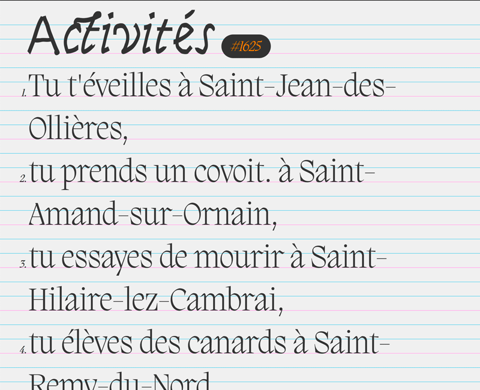

# ligneDeBase.js
Dessine une grille de ligne de base sur votre page web (avec un canvas).

Utile, si vous cherchez à caler (visuellement via les outils développeurs de votre navigateur) des élements html dans votre mise en page, des textes notamment.



**usage:**

importer la lib dans la page (dans le header, p.ex.)
```html
<script src="js/ligneDeBase.js"></script>
```
_Dans <script>_
  
_ligneDeBase.show(pattern,margin,level,style);_
```js
ligneDeBase.show(5,20,"dotted");
// ou passage d'un objet contenant un ou plusieurs paramètres
ligneDeBase.show({'pattern': 3,'style':"dotted", 'under':"yourHTMLElement", 'margin':"2rem"})
```
**paramètres:**
- `size`: [facultatif] taille de la grille (en px), par défaut, le script calcule la grille en fonction du `font-size` sur le body et utilise un `line-height` de 120%
- `style`: [facultatif] `"dotted"` ou `"solid"` (paramètre de la ligne). Par défaut, `'style' : "dotted"`
- `pattern`: [facultatif] répétition du motif de couleurs -> color / colorM. Par défaut le `'pattern' = 5`
```js
// crée une grille de ligne de base avec une alternance de 2 lignes bleues, une ligne rose
ligneDeBase.show({'pattern': 3,'style':"dotted"})
```
- `color`: [facultatif] couleur des lignes intermédiaires (propriété css  -> rgb(255,0,0) ou rgba(255,0,0,.5). Par défaut `'color' : "rgba(0,176,228,.66)"`
- `colorM`: [facultatif] couleur des lignes principales (propriété css  -> rgb(255,0,0) ou rgba(255,0,0,.5). Par défaut, `'colorM' : "rgba(255, 100, 217,1)"`
- `margin`: [facultatif] décalage vertical de la ligne de base. Par défaut, `'margin' : 0`
Accepte une String (p.ex: `8rem`) en rem uniquement ou `Chiffre` (sera converti en px).
- `under:` [facultatif] accepte un ElementHTML (p.ex. "main") ou une classe (p.ex. ".classe") ou un ID (p.ex "#id"). Par défaut, le canvas est dessiné au dessus de tout (peut être problematique avec le "examiner l'élement" de l'outil développeur des navigateurs.

